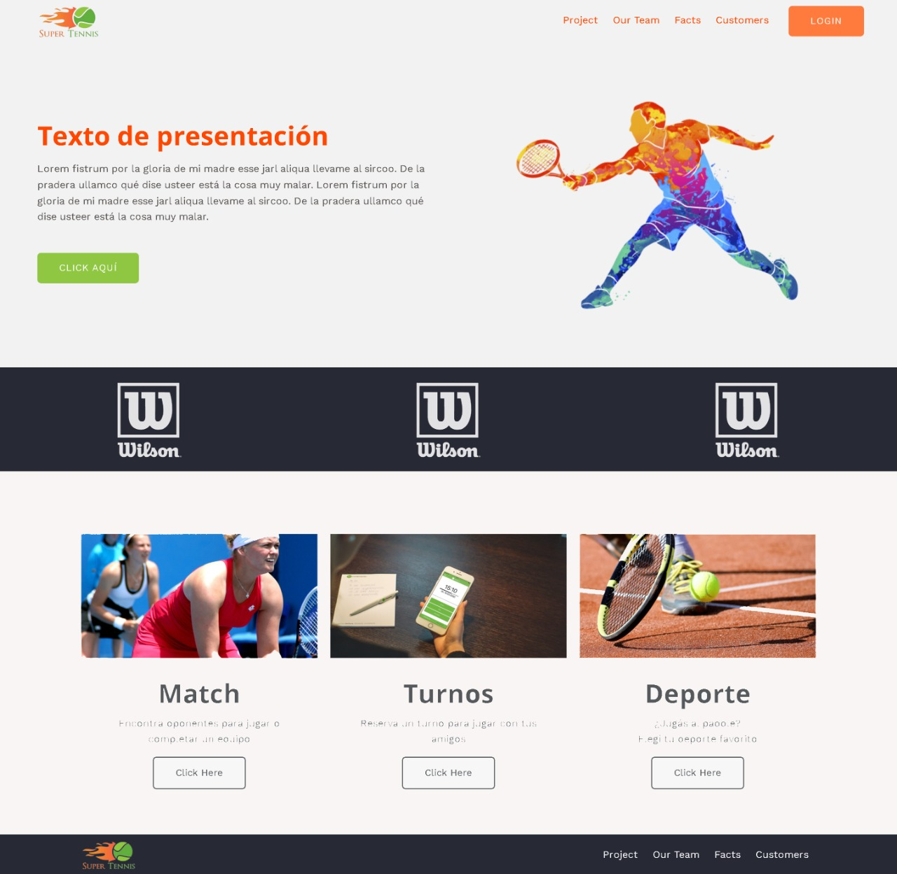

# __PF - Henry: MATCH POINT__

## Objetivos del Proyecto

- Construir una App utlizando React, Redux, Node y Prisma entre otras.
- Afirmar y conectar los conceptos aprendidos en la carrera.
- Aprender mejores prácticas.
- Aprender y practicar el workflow de GIT.
- Practicar métodos de SCRUM.
- Usar y practicar testing.


## BoilerPlate

El boilerplate cuenta con dos carpetas: `api` y `client`. En estas carpetas estará el código del back-end y el front-end respectivamente.

En `api` podrá encontrar además del archivo `index.js` (para levantar la app y sicronizar DB), las carpetas `test` y `src`.
En esta última los archivos `app.js` y `db.js`, junto a los folders:

- [models] ---> para crear las tablas de la `DB`.
- [routes] ---> para crear las rutas que va a consumir el `front`.
- [controllers] ---> para descongestionar de código en las `rutas` y generar la lógica necesaria para las mismas aquí.
- [util] ---> para alojar funciones más complejas y extensas y reducir código en los `controllers`.


En `api` crear un archivo llamado: `.env` que tenga la siguiente forma:

```env
DB_USER = postgres
DB_PASSWORD = SU PASSWORD
DB_HOST = 5432
PORT = 3001
FRONT = 3000
```

__``Opción 1:`` Desde la consola creamos nuestra base de datos__

```psql
psql
```
Luego:
```sequelize
CREATE DATABASE matchpoint
    WITH
    OWNER = postgres
    ENCODING = 'UTF8'
    CONNECTION LIMIT = -1
    IS_TEMPLATE = False;

COMMENT ON DATABASE matchpoint
    IS 'DB funcional de MATCH POINT APP
Esta base de datos guarda la información en tables relacionales para el consumo de la app Match Point; permitiendo el almacemnamiento, modificación y solicitud de la información necesaria para dar a los jugadores y al administrador el mejor uso de acuerdo a sus necesidades específicas.';
```
__Recordar__

Reemplazar `postgres` y `SU PASSWORD` con tus propias credenciales para conectarte a postgres.
Este archivo va ser ignorado en la subida a github, ya que contiene información sensible (las credenciales).

Adicionalmente será necesario que creen desde psql una base de datos llamada __`matchpoint`__.

El contenido de `client` fue creado usando: Create React App, y revestido de las dependencias necesarias para implementar Redux.


En `client` podrá encontrar, dentro de `src`, además del archivo `index.js` (con el ReactDOM) y `app` (con las rutas del front), los siguientes folders: 

- [assets] ---> para incorporar todo tipo de archivo multimedia (imagenes, videos, tutoriales, audios).
- [components] ---> modularizamos aqui todos los componentes.
- [hooks] ---> además de todos los hooks nativos de  `react` podemos crear nuestros propios hooks funcionales que realicen alguna acción dentro de los componente, pero que extraemos el código y lo ponemos aquí para no recargar el componente y que quede por demás extenso. En la medida de lo posible, la lógica siempre fuera del componente.
- [redux] ---> aqui `actions`, `reducer` y `store` para el manejo de un store global.
- [styles] ---> aquí todos los archivos de estilos modularizados que serán llamados luego por los componentes.





## __Enunciado__

Proyecto Full Web Stack de un e-commerce para contratar canchas de tenis y encontrar rivales de juego. 
El player podrá ir eligiendo de forma dinámica los contrincantes que quedarán almacenados en una tabla, la cual podrá borrar, modificar o confimar y convertirse así en una instancia de juego; a su vez podrá elegir la cancha, día y hora a jugar.
Finalmente reservar mediando un pago sea del 100% del valor, o bien el 50% para terminar de abonar en el lugar. 


#### Tecnologías usadas
- [ ] React
- [ ] Redux
- [ ] Express
- [ ] Sequelize - PostgreSQL 


  
# Testing

- [ ] Al menos tener 5 componentes del frontend con sus tests respectivos
- [ ] Al menos tener 5 rutas del backend con sus tests respectivos
- [ ] Al menos tener 5 modelos de la base de datos con sus tests respectivos
